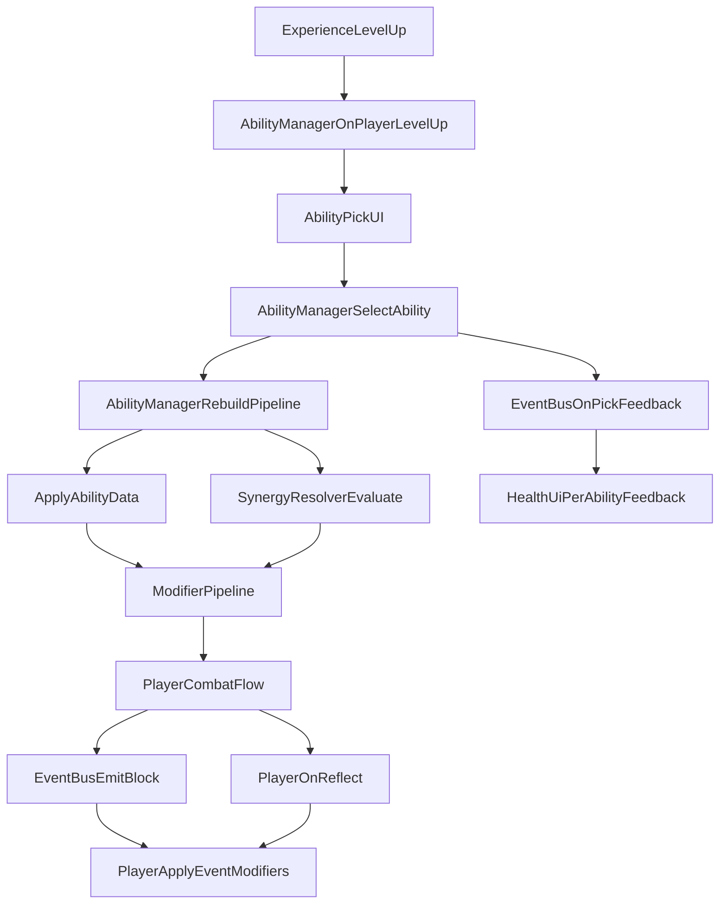

# ShieldCore

Godot 4.6.2 的 2D 竖屏格挡游戏，核心玩法围绕玩家移动格挡、经验升级、能力组合与弹幕波次生存。Web 版通过 CI 导出并部署到 GitHub Pages。

## 项目结构

| 目录 | 用途 |
|------|------|
| `main.tscn` | 游戏入口，实例化各 feature 场景与系统节点 |
| `start/` | 背景、提示文案、版本标签 |
| `player/` | 玩家移动、护盾格挡/反弹、能力效果消费 |
| `bullet/` | 弹幕实体、`bullet_spawner`、`wave_director` 与 `wave_config.json` |
| `bomb/` | B 弹清屏系统与 UI |
| `health/` | 生命组件（`health.gd`）、分段血条 UI（`health_ui.gd`、`health_segment.tscn`） |
| `experience/` | 经验值与升级 UI |
| `ability/` | 能力定义、实例、管理器、管线、联动、三选一 UI、获得反馈 |
| `game_over/` | 游戏结束 UI；再开局前调用 `AbilityManager.reset_for_new_run()`（见下文「局生命周期」） |
| `pause/` | 暂停 UI；内含 **GM 模式**（调试：从暂停菜单直接获得任意能力） |
| `assets/` | 跨 feature 共享资源（如 `assets/fonts/NotoSansSC.ttf`，由 CI 下载） |

**Autoload**：`EventBus`（`ability/event_bus.gd`）、`AbilityManager`（`ability/ability_manager.gd`）。

## 部署与 PR 预览

- **主站**：推送到 `main` 后，`.github/workflows/deploy-pages.yml` 会重新构建 Web 包并发布到 `gh-pages` 分支根目录，访问 `https://<owner>.github.io/<repo>/`。
- **PR 预览**：`.github/workflows/pr-preview.yml` 在 PR **opened / synchronize / reopened** 时构建 PR head，产物发布到 `gh-pages` 的 `pr-preview/pr-<number>/`，并在 PR 上**新增**一条带 `<!-- shield-core-pr-preview -->` 标记的预览评论（每次推送一条，便于对照各次提交）。PR **closed**（合并或关闭）时清理对应子目录，并将该 PR 上**所有**带上述标记的评论统一更新为「预览已下线」说明。
- **Fork PR**：无仓库写权限的 fork PR 会跳过预览构建与清理。
- **必要配置**：仓库 Settings → Pages → Build and deployment 须为 **`Branch: gh-pages / root`**；首次工作流运行会自动创建 `gh-pages` 分支。

构建步骤由 composite action `.github/actions/build-godot-web/` 统一完成（Godot 4.6.2-stable、字体下载、`--import`、Web 导出）。版本号见根目录 `version.gd`（CI 导出前会 patch `BUILD_NUMBER`）。

## 能力系统架构

能力系统由能力定义、运行时实例、效果管线、联动解析和战斗消费层组成。

### 核心模块

| 文件 | 角色 | 关键职责 |
| --- | --- | --- |
| `ability/ability_definition.gd` | 静态定义 | 从配置读取能力元数据与 `per_level` 效果。 |
| `ability/ability_instance.gd` | 运行时实例 | 记录玩家当前持有能力与可重复能力的叠加次数。 |
| `ability/ability_manager.gd` | 系统入口（Autoload） | 加载能力、升级三选一、处理重复获取、应用实例效果、重建管线；`reset_for_new_run()` 清空本局已获得能力（再开局用）。 |
| `ability/modifier_pipeline.gd` | 效果容器 | 聚合属性加成与运行时效果（事件修饰器、运行时标记）。 |
| `ability/synergy_resolver.gd` | 联动解析器 | 根据 `required_abilities` 激活联动。 |
| `ability/event_bus.gd` | 事件总线（Autoload） | 发射格挡、受伤、波次、B 弹、`on_ability_acquired`、`on_pick_feedback` 等事件。 |
| `health/health.gd` | 生命组件 | 管理当前/最大生命，支持动态上限（`set_max_health`）。 |
| `health/health_ui.gd` | 分段血条 UI | 按 `CELL_HP=10` 动态增删 `HealthSegment`；订阅 `on_pick_feedback` 播放能力专属反馈。 |
| `health/health_segment.gd` | 单格血条 | `set_fill_immediate`、`play_sweep_animation`（扩容扫光）、`play_regen_flash`（绿闪）。 |
| `player/player.gd` | 战斗消费层 | 读取 pipeline 属性、按能力 ID 读取行为型 `per_level`、执行事件修饰器。 |
| `ability/pick_ui/ability_pick_ui.gd` | 升级 UI | 三选一候选展示与选择。 |
| `ability/feedback/ability_feedback.gd` | 中央浮字反馈 | 订阅 `AbilityManager.ability_acquired`，屏幕中央「获得【能力名】」淡入淡出。 |
| `pause/pause_ui.gd` | 暂停 / GM | 暂停菜单；GM 模式调用 `AbilityManager.select_ability()` 直接获得能力。 |
| `bomb/bomb_system.gd` | B 弹系统 | 双击/Space 清屏，充能从 pipeline 读取容量与冷却加成。 |

### 局生命周期与 Autoload 状态

`EventBus` 与 `AbilityManager` 注册为 **Autoload**，在 `get_tree().reload_current_scene()` 时**不会**随 `main.tscn` 重载而销毁。场景内节点（玩家、`health`、`bomb_system`、经验等）会随场景重建，在各自 `_ready()` 中恢复初始状态。

游戏结束后再开局（`game_over/game_over_ui.gd`：触摸 / 点击 / 按键）顺序为：

1. **`AbilityManager.reset_for_new_run()`** — 清空 `_instances`、待处理升级次数、三选一进行中标志、`_player` 引用；`pipeline.reset()` 后重建空管线，并 `abilities_updated.emit()`。
2. **`get_tree().reload_current_scene()`** — 重载 `main.tscn`；`player.gd` 在 `_ready()` 中再次 `register_player(self)` 并订阅 `abilities_updated`。

因此修改「重新开始」或能力持久化逻辑时，须同时考虑 Autoload 与场景节点的分工，避免仅重载场景却遗留上局能力实例。

### 运行时流程



### 能力效果的两条接入路径

1. **管线属性型**：`per_level` 中的键若列入 `AbilityManager._apply_instance_to_pipeline()` 白名单，会累加到 `ModifierPipeline`，由 `player.gd`、`bomb_system.gd` 等通过 `get_attribute()` 消费。当前白名单：
   - `speed_bonus`、`bullet_speed_bonus`、`damage_bonus`、`block_xp_bonus`、`max_health_bonus`
   - `bomb_capacity_bonus`、`bomb_recharge_seconds_bonus`
2. **行为型（按能力 ID 接线）**：如 `shield_reflect`（`reflect_chance`）、`counter_spiral`、`health_regen`、`crit_block`、`breathing_orbit` 等，在 `player/player.gd` 中通过 `AbilityManager.get_instance(ability_id)` 读取 `per_level` 数据并执行逻辑。新增此类能力需在 `player.gd`（或对应系统脚本）增加分支。

联动注入的 `attribute_bonus`（如 `shield_radius_bonus`）不经过能力白名单，由 `synergy_resolver.gd` 直接写入 pipeline。

### 获得反馈（双通道）

选择能力后（`AbilityManager.select_ability`）并行触发两类非阻塞反馈：

1. **中央浮字** — `ability/feedback/ability_feedback.gd` 监听 `AbilityManager.ability_acquired`，显示「获得【能力名】」。
2. **按能力定制的 UI 反馈** — 同一流程末尾由 `AbilityManager` 发射 `EventBus.on_pick_feedback(ability_id, level)`；各 feature 自行 `connect` 并按 `ability_id` 分支。

当前 `health/health_ui.gd` 已接线的 `ability_id`：

| `ability_id` | 反馈表现 |
| --- | --- |
| `max_health_up` | 新增血量格：`HealthSegment.play_sweep_animation`（0→满→真实填充率）。 |
| `health_regen` | 全部已有格子：`play_regen_flash`（填充条闪绿约 0.3s）。 |

新增按能力 UI 反馈：在目标 UI 脚本连接 `EventBus.on_pick_feedback`，无需改动 `ability_feedback.gd`。

### 当前能力规则（实现状态）

- 大部分能力为「唯一能力」：获得后不再进入候选池。
- `max_health_up`（稳固边界）为**可重复**能力：可多次进入候选池，每次叠加 `max_health_bonus`。
- 能力定义**已移除 tags 系统**；联动条件仅使用 `required_abilities` 精确匹配能力 ID。
- 配置支持可选字段 `narrative`（叙事文案，供 UI/文档使用）。

当前 `abilities_config.json` 中的能力 ID 示例：`speed_boost`、`shield_reflect`、`counter_spiral`、`health_regen`、`crit_block`、`max_health_up`、`breathing_orbit`。

## 配置文件说明

### 1) 能力定义：`ability/abilities_config.json`

每个能力一条 `abilities` 项，常用字段：

- `id`：能力唯一 ID（`snake_case`，不可重复）。
- `name` / `description`：展示文本。
- `narrative`（可选）：叙事向说明。
- `rarity`：稀有度（1 普通 / 2 稀有 / 3 史诗）。
- `weight`：升级候选池权重。
- `max_level`：最大等级（当前固定为 `1`）。
- `repeatable`：是否可重复获得（默认 `false`；当前仅 `max_health_up` 为 `true`）。
- `per_level`：效果数组（1-based 索引习惯，当前仅用第 1 项）。

> 能力定义不再包含 `tags` / `affects_tags` / `responds_to_tags`。联动请用 `required_abilities` 指定能力 ID。

示例（管线属性型）：

```json
{
  "id": "speed_boost",
  "name": "惶惶",
  "description": "移动速度大幅提升",
  "rarity": 1,
  "weight": 100,
  "max_level": 1,
  "per_level": [
    { "speed_bonus": 60 }
  ]
}
```

> `ability_manager.gd` 仅自动聚合上述白名单属性键。新增属性键需扩展 `_apply_instance_to_pipeline()` 并在消费方读取。可重复能力按**获得次数**重复应用同一份 `per_level[0]`。

示例（可重复能力）：

```json
{
  "id": "max_health_up",
  "name": "稳固边界",
  "repeatable": true,
  "per_level": [
    { "max_health_bonus": 10 }
  ]
}
```

### 2) 联动定义：`ability/synergies_config.json`

- **条件**：`required_abilities`（至少 1 个 ID；组合联动一般 2 个及以上）。
- **效果**：`effect`（单条）或 `effects`（数组，推荐）。

已支持的 `effect.type`：

- `attribute_bonus`：增加 pipeline 属性（如 `shield_radius_bonus`）。
- `runtime_flag`：注册运行时标记。
- `event_modifier`：注册事件修饰器（`on_block`、`on_reflect` 等）。

示例（双能力联动）：

```json
{
  "id": "vital_fortress",
  "required_abilities": ["health_regen", "shield_reflect"],
  "description": "生命要塞：格挡时额外恢复 1 点生命。",
  "effect": {
    "type": "event_modifier",
    "event": "on_block",
    "action": "heal",
    "amount": 1
  }
}
```

当前已配置联动：`swift_guardian`（惶惶 + 盾反 → 护盾半径）、`vital_fortress`（生命恢复 + 盾反 → 格挡回血）。

### 3) 弹幕波次：`bullet/wave_config.json`

由 `wave_director.gd` 读取，控制 prep/duration、发射间隔、`bullet_speed` 与 `pattern`（如 `single_aimed`、`fan_3_tight`、`ring_12` 等）。波次生命周期通过 `EventBus` 的 `on_wave_prep_started` / `on_wave_started` / `on_wave_ended` 广播。

## 新增能力步骤

按「先配置、后接线、再验证」进行。

### A. 新增普通能力（不涉及联动）

1. 在 `ability/abilities_config.json` 新增条目。
2. 确认接入路径：
   - 纯属性且键已在白名单：通常无需额外代码。
   - 新属性键：扩展 `ability_manager.gd` 白名单 + 消费方读取。
   - 行为型：在 `player/player.gd`（或 `bomb_system.gd` 等）按 `ability_id` 读取并实现。
3. 调整 `weight` / `rarity`；可重复能力设置 `repeatable: true`，并避免将其误加入仅需「拥有一次」的联动条件（若设计需要「叠层」联动需单独约定）。

### B. 新增联动

1. 在 `ability/synergies_config.json` 添加 `required_abilities` 与 `effect` / `effects`。
2. 新 `event_modifier.action` 需在 `player/player.gd` 的 `_apply_single_event_modifier()` 增加分支。

## 事件修饰器 action

`player/player.gd` 当前支持：

- `heal`
- `bonus_xp`
- `reflect_speed_multiplier`

新增 action：在 `synergies_config.json` 定义 → `_apply_single_event_modifier()` 实现 → 实机验证。

## 物理层

```
layer_1: player_core
layer_2: player_shield
layer_3: enemy_bullet
layer_4: player_bullet
```

## 验证建议

- 语法与启动检查：`godot --headless --path . --quit`
- 玩法：升级三选一、管线重建、联动触发、可重复生命上限（扫光）、`health_regen` 绿闪、B 弹充能、波次循环；**游戏结束后再开局**应无已获能力、候选池与管线属性回到初始；调试可用暂停 → GM 模式
- Web 导出（与 CI 一致）：`godot --headless --export-release "Web" build/web/index.html`（需已安装 4.6.2 导出模板）
