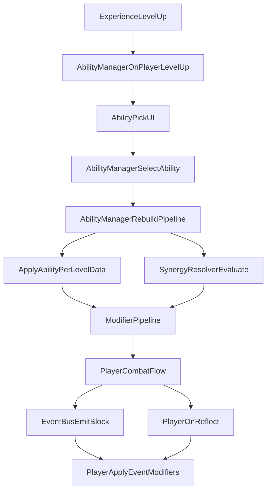

# ShieldCore

Godot 4.6.2 的 2D 竖屏游戏项目，核心玩法围绕玩家格挡、升级与能力组合。

## 能力系统架构

当前项目中的“能力系统”由能力定义、运行时实例、效果管线、联动解析和战斗消费层组成。

### 核心模块

| 文件 | 角色 | 关键职责 |
| --- | --- | --- |
| `ability/ability_definition.gd` | 静态定义 | 从配置读取能力元数据与每级效果。 |
| `ability/ability_instance.gd` | 运行时实例 | 记录玩家当前持有能力与等级。 |
| `ability/ability_manager.gd` | 系统入口（Autoload） | 加载能力、升级三选一、应用实例效果、重建管线。 |
| `ability/modifier_pipeline.gd` | 效果容器 | 聚合属性加成、标签效果、运行时事件修饰器。 |
| `ability/synergy_resolver.gd` | 联动解析器 | 根据 `required_abilities` / `required_tags` / `min_levels` 激活联动。 |
| `ability/event_bus.gd` | 事件总线（Autoload） | 发射战斗事件与能力系统事件。 |
| `player/player.gd` | 战斗消费层 | 在格挡/反弹等流程中读取 pipeline 并执行效果。 |
| `ability/pick_ui/ability_pick_ui.gd` | 升级 UI | 接收候选能力，处理三选一。 |

### 运行时流程



## 配置文件说明

### 1) 能力定义：`ability/abilities_config.json`

每个能力一条 `abilities` 项，常用字段如下：

- `id`：能力唯一 ID（建议 `snake_case`，不可重复）。
- `name` / `description`：展示文本。
- `rarity`：稀有度（1 普通 / 2 稀有 / 3 史诗）。
- `weight`：升级候选池权重。
- `max_level`：能力最大等级。
- `tags`：能力标签（用于联动判定）。
- `affects_tags` / `responds_to_tags`：保留给标签与事件体系的数据字段。
- `per_level`：每一级的效果字典（1-based）。

示例（属性型能力）：

```json
{
  "id": "dash_core",
  "name": "冲刺核心",
  "description": "提升移动速度。",
  "rarity": 1,
  "weight": 90,
  "max_level": 3,
  "tags": ["attribute", "movement"],
  "affects_tags": [],
  "responds_to_tags": [],
  "per_level": [
    {"speed_bonus": 50},
    {"speed_bonus": 100},
    {"speed_bonus": 160}
  ]
}
```

> 注意：`ability_manager.gd` 目前只会自动聚合 `speed_bonus`、`bullet_speed_bonus`、`damage_bonus`、`block_xp_bonus` 这几个属性键。新增属性键时，需要同步扩展 `AbilityManager._apply_instance_to_pipeline()` 与对应消费代码。

### 2) 联动定义：`ability/synergies_config.json`

每个联动一条 `synergies` 项，支持：

- 条件字段：
  - `required_abilities`：按能力 ID 精确匹配（优先）。
  - `required_tags`：按标签匹配（兜底）。
  - `min_levels`：可选等级门槛（按能力 ID 指定）。
- 效果字段：
  - `effect`：单效果（兼容写法）。
  - `effects`：多效果数组（推荐写法）。

已支持的 `effect.type`：

- `attribute_bonus`：增加属性。
- `tag_enhance`：向标签效果链注入增强信息。
- `runtime_flag`：注册运行时标记。
- `event_modifier`：注册事件修饰器（`on_block`、`on_reflect` 等）。

示例（融合/套装）：

```json
{
  "id": "cat_guardian_set",
  "required_abilities": ["shield_reflect", "burn_shield", "crit_block"],
  "effects": [
    {"type": "runtime_flag", "flag": "cat_guardian_set_active"},
    {"type": "event_modifier", "event": "on_block", "action": "heal", "amount": 1},
    {"type": "event_modifier", "event": "on_block", "action": "bonus_xp", "amount": 5}
  ]
}
```

## 新增能力步骤

按“先配置、后接线、再验证”的方式进行。

### A. 新增普通能力（不涉及融合）

1. 在 `ability/abilities_config.json` 新增能力条目，补齐 `id`、`tags`、`per_level` 等字段。
2. 确认能力类型：
   - 纯属性型：复用已有属性键时无需额外代码。
   - 新属性键：扩展 `ability/ability_manager.gd` 的属性白名单，并在消费方（如 `player/player.gd`）读取该属性。
   - 行为型（格挡/反弹触发）：在 `player/player.gd` 增加对应执行逻辑，或通过联动 `event_modifier` 路径接入。
3. 调整 `weight` 与 `rarity`，避免候选池失衡。

### B. 新增能力融合（2 能力组合）

1. 在 `ability/synergies_config.json` 新增联动条目。
2. 使用 `required_abilities` 指定两个能力 ID（推荐精确匹配）。
3. 按需求配置 `effect` / `effects`：
   - 数值增强：`attribute_bonus`
   - 事件增强：`event_modifier`
   - 状态标记：`runtime_flag`
4. 若使用新的 `event_modifier.action`，在 `player/player.gd` 的 `_apply_single_event_modifier()` 增加对应分支。

### C. 新增能力套装（3+ 能力组合）

1. 在联动中添加 `required_abilities`（3 个或更多）。
2. 可选增加 `min_levels` 作为进阶套装门槛。
3. 使用 `effects` 叠加多个效果（如回血 + 额外经验 + 标记）。

## 事件修饰器 action 扩展说明

当前 `player/player.gd` 已支持以下 `event_modifier.action`：

- `heal`
- `bonus_xp`
- `reflect_speed_multiplier`
- `burn_on_reflect`

若要新增 action：

1. 在 `synergies_config.json` 里定义新 action 名。
2. 在 `player/player.gd` 的 `_apply_single_event_modifier()` 中实现行为分支。
3. 通过联动配置触发并验证日志输出。

## 验证建议

- 语法与启动检查：
  - `godot --headless --path . --quit`
- 玩法验证：
  - 升级弹窗是否正常出现并可选择能力。
  - 能力升级后 `AbilityManager` 是否重建管线。
  - 双能力融合是否按条件触发。
  - 三能力套装是否触发额外效果。
  - 未满足条件时联动是否不会误触发。
